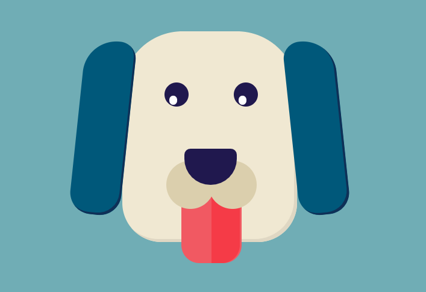

# Doggy - maluj w Internecie!

Kod powstał na potrzeby przeprowadzenia lekcji online i udziału w konkursie "Edukacja Jutra" organizowanego przez PFR.

Podgląd projektu: https://martatomchuck.github.io/doggy/

